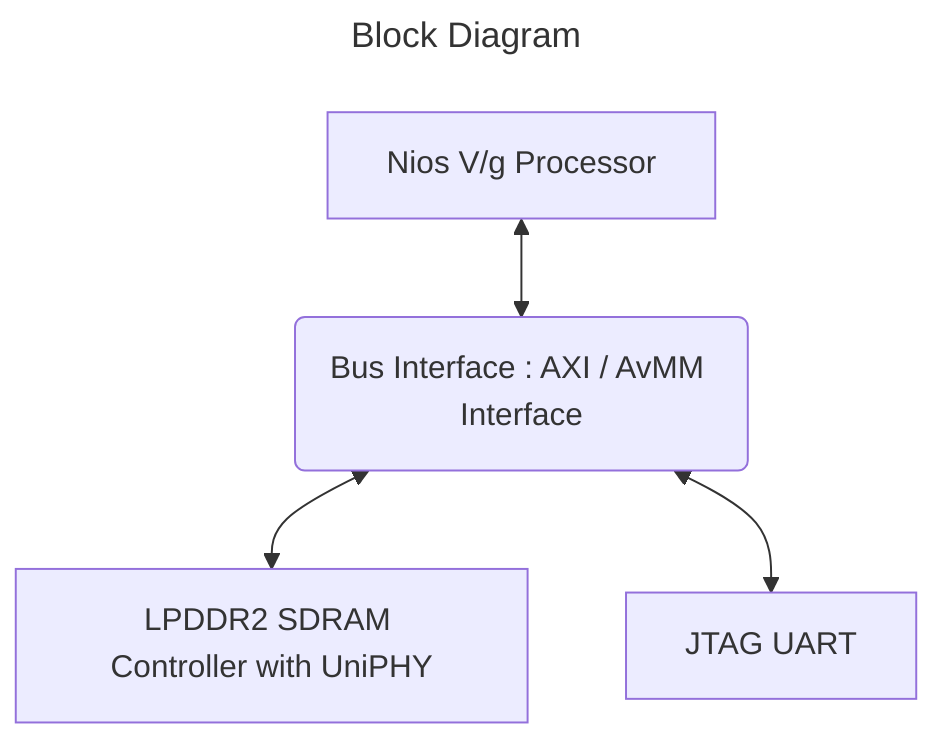

## Introduction

### Nios® V/g TinyML LiteRT Example Design Overview

This design demonstrates the TinyML application using LiteRT for microcontrollers software with Nios® V/g processor in the MAX® 10 FPGA 10M50 Evaluation Kit DK-DEV-10M50F484-B.

### Prerequisites

 - MAX® 10 FPGA 10M50 Evaluation Kit, ordering code DK-DEV-10M50F484-B. Refer to the board documentation for more information about the development kit.
 - Mini and Micro USB Cable. Included with the development kit.
 
### Release Contents  

#### Binaries
 - Prebuilt binaries are located [here](https://github.com/altera-fpga/max10-ed-nios/tree/rel/24.1std/max10-10m50-evaluation-dev-kit/niosv_g/tinyml_liteRT/ready_to_test)
 - The sof and elf files required to run the design can be found in "ready_to_test" folder 
 - Program the sof and download the elf file on board

### Nios® V/g TinyML LiteRT Design Architecture
 This example design includes a Nios® V processor connected to the LPDDR2 external memory and JTAG UART IP. The objective of the design is to accomplish data transfer between the processor and soft IP peripherals.



#### Nios® V/g Processor 
- Nios® V/g processor is highly customizable and can be tailored to meet specific application requirements, providing flexibility and scalability in embedded system designs.

 
#### IP Cores
 The following IPs are used in this Platform Designer component of the design:
- Nios® V/g soft processor core

- LPDDR2 SDRAM Controller with UniPHY

- JTAG UART

- Clock Source, Reset Bridge


### Hardware Setup

  Refer to [MAX® 10 FPGA 10M50 Evaluation Kit User Guide](https://www.intel.com/content/www/us/en/docs/programmable/683447/current/max-10-fpga-10m50-evaluation-kit-overview.html) to setup the hardware connection.


### Address Map Details

#### Nios V Address Map
 |Address Offset	|Size (Bytes)	|Peripheral	| Description|
  |-|-|-|-|
  |0x0|128M|LPDDR2 Memory|To store application|
  |0x0803_0040|8|JTAG UART|Communication between a host PC and the Nios V processor system|


## User Flow 

 There are two ways to test the design based on use case. 

   <h5> User Flow 1: Testing with Prebuild Binaries.</h5>
   
   <h5> User Flow 2: Testing Complete Flow.</h5>

 |User Flow|Description|Required for [User flow 1](#user-flow-1-testing-with-prebuild-binaries)|Required for [User flow 2](#user-flow-2-testing-complete-flow)|
 |-|-|-|-|
 |Environment Setup|[Tools Download and Installation](#tools-download)|Yes|Yes|
 |Compilation|Hardware compilation|No|Yes|
 ||Software compilation|No|Yes|    
 |Programing|Program Hardware Binary SOF|Yes|Yes|
 ||Program Software Image ELF|Yes|Yes|
 |Testing|Open JTAG UART Terminal|Yes|Yes|

### Environment Setup

#### Tools Download and Installation
1. Quartus Prime Standard

 - Download the Quartus® Prime Standard Edition software version 24.1 from the FPGA Software Download Center webpage of the Intel website. Follow the on-screen instructions to complete the installation process. Choose an installation directory that is relative to the Quartus® Prime Standard Edition software installation directory.
 - Set up the Quartus tools in the PATH, so they are accessible without full path.
```console
export QUARTUS_ROOTDIR=~/altera/24.1std/quartus/
export PATH=$QUARTUS_ROOTDIR/bin:$QUARTUS_ROOTDIR/linux64:$QUARTUS_ROOTDIR/../qsys/bin:$PATH
```

### Compilation 

#### Hardware Compilation 
 - Invoke the `quartus_py` shell in the terminal
 - Run the following command in the terminal from top level project directory:
 
```console
quartus_py ./scripts/build_sof.py
```

 - The quartus tool will compile the design and generate the output files

#### Software Compilation 
- To create software app, run the following commands in the terminal:
```console
niosv-bsp -c --sopcinfo=hw/top.sopcinfo --type=hal --bsp-dir=sw/tflite_bsp --script=sw/bsp_script.tcl sw/tflite_bsp/settings.bsp
niosv-app --bsp-dir=sw/tflite_bsp --app-dir=sw/tflite_app --srcs-recursive=sw/tflite_app/image_classification,sw/tflite_app/signal,sw/tflite_app/tensorflow --incs=sw/tflite_app,sw/tflite_app/image_classification/model,sw/tflite_app/image_classification/image,sw/tflite_app/tensorflow,sw/tflite_app/third_party/flatbuffers/include,sw/tflite_app/third_party/gemmlowp,sw/tflite_app/third_party/kissfft,sw/tflite_app/third_party/ruy
cmake -S sw/tflite_app -B sw/tflite_app/build/Release -G "Unix Makefiles" -DCMAKE_BUILD_TYPE=Release
make -C sw/tflite_app/build/Release
```
Note:The software can be compiled using the Ashling Visual Studio Code Extension for Altera FPGAs

For information on the build process, please refer to the following document- [Ashling VSCode Extension](https://www.intel.com/content/www/us/en/docs/programmable/730783/current/ashling-visual-studio-code-extension.html)

### Programing 
Note: Reduce the JTAG clock frequency to 6MHz using the following command, before programming the sof file
```console
jtagconfig --setparam 1 JtagClock 6M
```

#### Program Hardware Binary SOF
- Program the generated sof and then download the elf file on the board
    
```console
quartus_pgm --cable=1 -m jtag -o 'p;ready_to_test/top.sof'
```

#### Program Software Image ELF
- Download the elf file on the board
```console
niosv-download -g -r ready_to_test/tflite_app.elf -c 1
```

### Testing

#### Open JTAG UART Terminal
- Verify the output on the terminal by using the following command in the terminal:
    
```console
juart-terminal -c 1 -i 0 
```


